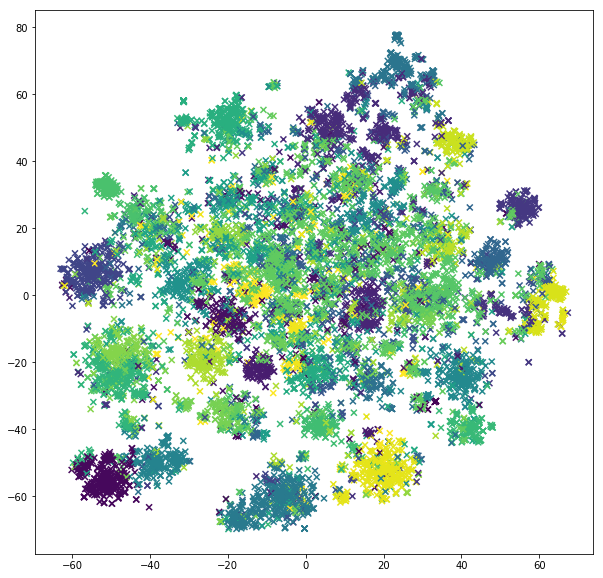

# trump-tweets

Repo for Batyr

## Data

`trump_tweets.csv` contains data made by Talon

`trump_tweets_raw.csv` contains data made by me with a help of [Trump Twitter Archive](http://www.trumptwitterarchive.com/archive)

`trump_tweets_cleaned.csv` contains data cleaned up using regex (check the file).

## Clustering (as of March 22, 2018)

Implemented tf-idf vectorization of a text (= list of tweets). Then, tried out nearest-neighbors algorithm to find similar tweets (works pretty well). Finally, fed into k-means model
and t-SNE for visualization of the most frequent/important terms.

#### t-SNE results

For the plots, check ```/clustering``` folder with png images.

**Example**

Perplexity = 50, 2D



#### References

- [Main article](https://beckernick.github.io/law-clustering/)
- [t-SNE paper](http://www.jmlr.org/papers/volume9/vandermaaten08a/vandermaaten08a.pdf)
- [TF-IDF](http://scikit-learn.org/stable/modules/generated/sklearn.feature_extraction.text.TfidfVectorizer.html)

## Text generation

#### Markov chains results

Example with *n-grams = 2* and *output text size = 50*:

> And their next word from thence upon he said a much the than that if any attempted with was patience, or spake with any obstruction may it startled be that those account conscience, and then settled wanted into writings strange time; with them going the cape and origin of the and rebellion ...

Example with *n-grams = 3* and *output text size = 75*:

> And in two or more i had the besides several that i took and killed for my food. after that, i enclosed five several pieces of the to feed them in, with little pens to drive them to take them at i could; and gates out of one difficulty of gratitude in another. but this was no only for now i not only thought goat’s flesh to feed on when i pleased, but milk too—a thing which, indeed, ...


## Further analysis

- Have to try out other methods for vectorization (CountVectorizer / Glove).
- Maybe hierarchical clustering instead of k-means? Have to compare those.
- PCA for dimensionality reduction instead of t-SNE.
- Recurrent neural networks with LSTMs for text generation (attention?).
